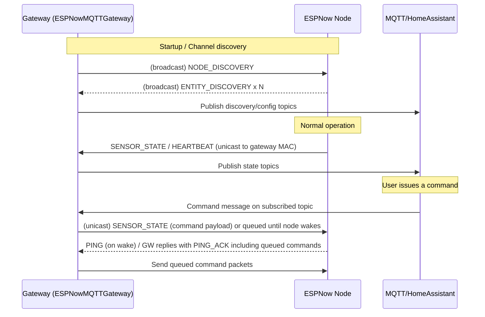

# ESPHomeNow

ESPHomeNow provides ready-to-use ESP-NOW components and example configurations to bridge an ESP-NOW device network to MQTT/Home Assistant. It includes an ESP-NOW gateway (that forwards device discovery and state to MQTT) and node components (button, switch, text, plus helpers for OTA and utilities) you can reuse or adapt in your ESPHome projects.

## Key Features
- ESP-NOW gateway implementation that bridges the ESP-NOW network to MQTT / Home Assistant (automated discovery + state topics).
- ESP-NOW node components for buttons, switches, and text messages (C++ + Python wrappers).
- Example ESPHome YAML configurations for gateway and node use: `espnow-gateway.yaml`, `espnow-node.yaml`.
- Utilities for OTA updates and image handling used by constrained devices.

## Repository Layout
- `espnow-gateway/` - C++ source and header for gateway component.
- `espnow-node/` - Node-side components: C++ sources, headers, and Python helpers (`button.py`, `text.py`, `switch.py`).
- `espnow-gateway.yaml`, `espnow-node.yaml` - Example ESPHome YAML configs to get started quickly.
- `common/` - Shared YAML fragments for OTA and other helpers.

## Quick Start
Use the provided example configs as the canonical setup. The library ships a `components/` folder you can either place under your ESPHome project root or reference via `external_components` (the examples use `external_components` → `path: components`). Open the included files for full, working templates: [espnow-gateway.yaml](espnow-gateway.yaml) and [espnow-node.yaml](espnow-node.yaml).

Gateway example:

```yaml
external_components:
  - source:
      type: local
      path: components
espnow_gateway:
  id: gateway
  num_nodes:
    name: "Number of Nodes"
    discovery: false
  nodes_list:
    name: "Associated Node Names"
    discovery: false

mqtt:
  id: mqtt_client
  on_connect:
    then:
      - lambda: "gateway->set_mqtt(id(mqtt_client));"

wifi:
  on_connect:
    then:
      - lambda: "gateway->initESPNow();"

```


Node example:

```yaml
external_components:
  - source:
      type: local
      path: components

espnow_node:
  id: gateway
  expiration: 30s

# Example text sensor provided by the espnow_node component
text:
  - platform: espnow_node
    name: Build Version
    node_id: gateway
    id: build_version

# Example switch entity controlled via the gateway
switch:
  - platform: espnow_node
    node_id: gateway
    name: Control light
    id: control_light
    restore_mode: RESTORE_DEFAULT_OFF
    on_turn_on:
      - light.turn_on: board_rgb_led
```

## How the Gateway and Nodes Work
Overview:
- The gateway acts as an ESP-NOW listener/bridge and an MQTT/ESPHome integration point. It receives packets from ESP-NOW nodes, publishes discovery and state messages to MQTT (Home Assistant friendly topics), and queues commands from MQTT back to nodes.
- Nodes implement the device-side ESP-NOW protocol: they announce entities, send sensor/state updates and heartbeats, and listen for command packets from the gateway.

Primary roles:
- Gateway: receives `NODE_DISCOVERY`, `ENTITY_DISCOVERY`, `SENSOR_STATE`, `HEARTBEAT` and `PING` packets; publishes Home Assistant discovery messages and state topics; subscribes to command topics and sends `SENSOR_STATE`-formatted command packets back to nodes.
- Node: broadcasts entity discovery, responds to gateway discovery/ping, sends state and heartbeat packets, and applies incoming command packets to registered entities.

Packet framing and structs:
- All packets are sent as packed C++ structs (no extra framing). The first byte of any packet is the `PacketType` enum value. Common types and structures (from `espnow_def.h`) include:
  - `packetHeader` — contains `PacketType type` (1 byte) and `char id[16]` (node id string).
  - `EntityDiscoveryPacket` — header + `Entity` description + node and sensor names + unit + expiration.
  - `NodeDiscoveryPacket` — header + node name and entity count.
  - `SensorPacket` — header + `Sensor` (entity id, type) and value (float) or text (char[128]). Used for both sensor updates and command messages.
  - `HeartbeatPacket` — header + uptime + heartbeat timeout.
  - `PingPacket` / `PING_ACK` — lightweight packet used for channel discovery/handshake; `PING_ACK` (sent by gateway) includes `isGateway` and `countCommands`.
  - `NodeSleep` — nodes inform gateway when they are going to sleep.

Direction and addressing:
- Broadcast vs unicast: nodes initially broadcast discovery and ping messages to FF:FF:FF:FF:FF:FF so any listening gateway can learn about them. After discovery/handshake, nodes record the gateway's MAC and send subsequent state/heartbeat packets unicast to that gateway.
- Gateway state: the gateway maintains a `node_names_` map keyed by node MAC that tracks per-node state (ONLINE / SLEEPING / OFFLINE), last-seen, and the per-node command queue. The gateway publishes discovery/state to MQTT and consumes command topics to enqueue commands for nodes.
- The native structs are packed to avoid padding; fields are copied as raw bytes into the ESP-NOW payload.

Implemented node/entity types
- Button: short/long press reporting (`components/espnow_node/espnow_button.*`, `button.py`).
- Switch: on/off control via command `SensorPacket` messages (`espnow_switch.*`, `switch.py`).
- Text sensor: arbitrary text payloads (`espnow_text.*`, `text.py`).
- Generic sensor values: `SensorPacket` supports floats and text; nodes can send arbitrary sensor updates using the `SENSOR_STATE` packets.
- Discovery & lifecycle: `NODE_DISCOVERY`, `ENTITY_DISCOVERY`, `HEARTBEAT`, `PING` handling are implemented.

Planned / not-yet-implemented items
- Dedicated `controls` entity examples (protocol supports them via `EntityType::CONTROLS`).
- Additional example sensor wrappers (voltage/humidity formatting) and richer OTA orchestration beyond the `common/jpg_ota` fragments.


*Device page in Home Assistant — discovery + state topics published by the gateway producing native HA entities.*


*Node UI showing a switch turned on; this is an example of an `espnow_node` device with a local LED tied to a `switch` entity.*

Sequence diagram (Mermaid)



Typical packet exchange sequence:
1. Gateway starts and periodically sends a `NODE_DISCOVERY` broadcast (single-byte payload of `PacketType::NODE_DISCOVERY`).
2. A node scanning channels receives the discovery and sets the gateway MAC. The node then publishes its entities by sending `EntityDiscoveryPacket` messages (usually broadcast) so the gateway can learn available entities.
3. The gateway receives `EntityDiscoveryPacket` messages and publishes Home Assistant discovery topics (MQTT) so sensors/devices appear automatically in Home Assistant. For entities that accept commands (switches, text inputs), the gateway subscribes to a command topic.
4. The gateway responds to node `PING` messages with a `PING_ACK` (a `PingPacket`) that includes `countCommands` (number of queued commands). Receiving `PING_ACK` causes the node to lock to the gateway channel and use the gateway MAC for subsequent unicast packets.
5. Nodes send `SENSOR_STATE` packets (packed `SensorPacket`) unicast to the gateway for state updates. The gateway publishes those values to the MQTT state topics.
6. When a command is published to the MQTT command topic, the gateway enqueues a `SensorPacket`-formatted command for that node. The gateway informs the node of pending commands via `PING_ACK` and sends queued command `SensorPacket`s back to the node (unicast).
7. Nodes receive `SENSOR_STATE` packets (when used as commands) and dispatch them to the corresponding entity handler to apply the requested change.
8. Nodes also periodically send `HEARTBEAT` packets to indicate liveness; the gateway publishes availability messages and manages node state (ONLINE, SLEEPING, OFFLINE).

How the gateway tracks node availability:
- The gateway maintains a `node_names_` map keyed by node MAC. Each entry stores `last_seen` (millis()), the node's `state` (ONLINE, SLEEPING, OFFLINE), and `sleep_duration` (seconds).
- For sleeping nodes the gateway uses `getProjectedWake()` (computed as `sleep_duration - (millis() - last_seen)/1000`) to estimate how many seconds remain until the node should wake. If `getProjectedWake()` becomes less than -3 seconds (i.e., the node missed its expected wake by ~3s), the gateway marks the node `OFFLINE` and stops considering it reachable until it next announces itself.
- For awake/ONLINE nodes, `last_seen` is refreshed on any incoming packet (PING, SENSOR_STATE, HEARTBEAT) and the node state is set to `ONLINE`.
- The gateway periodically publishes node lists and a JSON blob (`nodes_json`) so external systems can observe node health and projected wake time.

Notes on reliability and sizing:
- ESP-NOW payload size is limited (ESP32 typically ~250 bytes). The components use fixed-size packed structs and text buffers (e.g., 128 bytes for text values) — avoid oversized custom payloads.
- The gateway/code uses a simple request/ack style with `PING`/`PING_ACK` and a small command queue; this keeps down radio contention and is friendly to sleeping nodes.

Packet fields reference:
- `PacketType` — enum values: `NODE_DISCOVERY`, `ENTITY_DISCOVERY`, `SENSOR_STATE`, `TEXT_STATE`, `HEARTBEAT`, `NODE_NAME_ASSIGN`, `SENSOR_NAME_ASSIGN`, `PING`, `PING_ACK`, `NODE_SLEEP`.
- `EntityType` — sensor kinds: `TEMPERATURE`, `VOLTAGE`, `HUMIDITY`, `SENSOR`, `BINARY_SENSOR`, `RSSI`, `CONTROLS`, `SWITCH`, `BUTTON`, `TEXT`.

Advanced integration tips:
- If you want stronger delivery guarantees, add application-level acks in your node handlers or increase heartbeat/ping frequency for time-critical devices.
- Keep the node `id` stable (node id is derived from MAC bytes by default) so Home Assistant topics remain consistent.
