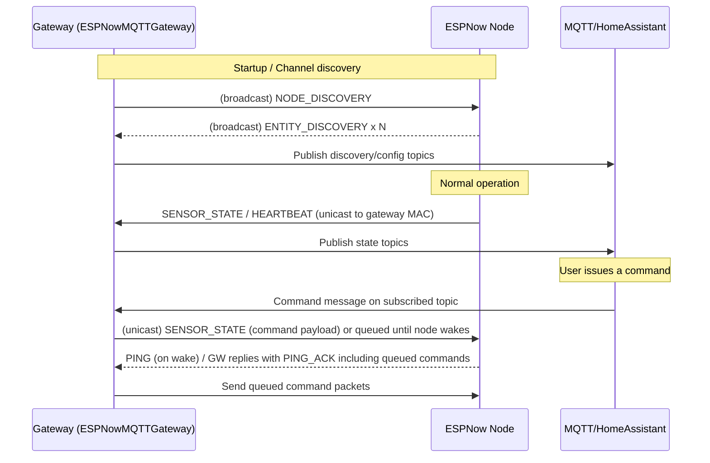

# ESPHomeNow

ESPHomeNow provides reusable ESP-NOW components and example configurations to bridge an ESP-NOW device network to MQTT / Home Assistant. It includes a gateway (forwards discovery and state to MQTT) and node components (button, switch, text, plus OTA and utility helpers).

## Table of contents
- [Key features](#key-features)
- [Repository layout](#repository-layout)
- [Quick start](#quick-start)
  - [Gateway example](#gateway-example)
  - [Node example](#node-example)
- [How it works](#how-it-works)
- [Packet exchange sequence](#packet-exchange-sequence)
- [Packet fields reference](#packet-fields-reference)
- [Notes & tips](#notes--tips)

## Key features
- ESP-NOW gateway that bridges an ESP-NOW network to MQTT / Home Assistant (automated discovery + state topics).
- ESP-NOW node components for buttons, switches, and text messages (C++ sources + Python helpers).
- Example ESPHome YAML configs: `espnow-gateway.yaml` and `espnow-node.yaml`.
- Utilities for OTA updates and image handling for constrained devices.

## Repository layout
- `espnow-gateway/` — C++ source and headers for the gateway component.
- `espnow-node/` — node-side sources, headers, and Python helpers (`button.py`, `text.py`, `switch.py`).
- `espnow-gateway.yaml`, `espnow-node.yaml` — example ESPHome configs.
- `common/` — shared YAML fragments (OTA helpers, utilities).

## Quick start
Use the example configs as a starting point. The project ships a `components/` folder you can add to an ESPHome project or reference via `external_components`.

See: [espnow-gateway.yaml](espnow-gateway.yaml) and [espnow-node.yaml](espnow-node.yaml)

### Gateway example

```yaml
external_components:
  - source:
      type: local
      path: components

espnow_gateway:
  id: gateway
  num_nodes:
    name: "Number of Nodes"
    discovery: false
  nodes_list:
    name: "Associated Node Names"
    discovery: false

mqtt:
  id: mqtt_client
  on_connect:
    then:
      - lambda: "gateway->set_mqtt(id(mqtt_client));"

wifi:
  on_connect:
    then:
      - lambda: "gateway->initESPNow();"
```

### Node example

```yaml
external_components:
  - source:
      type: local
      path: components

espnow_node:
  id: gateway
  expiration: 30s

text:
  - platform: espnow_node
    name: Build Version
    node_id: gateway
    id: build_version

switch:
  - platform: espnow_node
    node_id: gateway
    name: Control light
    id: control_light
    restore_mode: RESTORE_DEFAULT_OFF
    on_turn_on:
      - light.turn_on: board_rgb_led
```

## How it works
- Gateway: listens for ESP-NOW packets (`NODE_DISCOVERY`, `ENTITY_DISCOVERY`, `SENSOR_STATE`, `HEARTBEAT`, `PING`) and publishes Home Assistant discovery/state to MQTT. It also subscribes to MQTT command topics and queues commands for nodes.
- Node: announces entities, sends state and heartbeat packets, responds to pings, and accepts command packets.

Packets are packed C++ structs with the first byte indicating `PacketType`. Common packet types and structs are defined in `espnow_def.h`.

Direction & addressing
- Nodes initially broadcast discovery/ping messages to discover a gateway. After handshake, nodes record the gateway MAC and send subsequent packets unicast to that gateway.
- The gateway maintains per-node state (ONLINE / SLEEPING / OFFLINE), `last_seen`, and a per-node command queue.

Implemented entity types
- Button: short/long press reporting.
- Switch: on/off control via command `SensorPacket` messages.
- Text sensor: arbitrary text payloads.
- Generic sensor values: floats and text using `SENSOR_STATE` packets.

## Packet exchange sequence



Typical flow:
1. Gateway periodically sends `NODE_DISCOVERY` broadcast.
2. Nodes respond with `EntityDiscoveryPacket` messages so the gateway learns entities.
3. Gateway publishes Home Assistant discovery topics and subscribes to command topics for command-capable entities.
4. Gateway answers `PING` messages with `PING_ACK` including `countCommands`.
5. Nodes send `SENSOR_STATE` packets to update state; gateway republishes to MQTT.
6. Commands published via MQTT are queued and delivered when nodes wake or immediately if online.

## Packet fields reference
- `PacketType`: `NODE_DISCOVERY`, `ENTITY_DISCOVERY`, `SENSOR_STATE`, `TEXT_STATE`, `HEARTBEAT`, `NODE_NAME_ASSIGN`, `SENSOR_NAME_ASSIGN`, `PING`, `PING_ACK`, `NODE_SLEEP`.
- `EntityType`: `TEMPERATURE`, `VOLTAGE`, `HUMIDITY`, `SENSOR`, `BINARY_SENSOR`, `RSSI`, `CONTROLS`, `SWITCH`, `BUTTON`, `TEXT`.

## Notes & tips
- ESP-NOW payloads are limited (ESP32 ~250 bytes). Use fixed-size packed structs and avoid oversized text buffers.
- For stronger delivery guarantees, add application-level acknowledgements or increase heartbeats/ping frequency for critical devices.
- Keep node ids stable (derived from MAC by default) so Home Assistant topics remain consistent.

---


_*Device page in Home Assistant — discovery + state topics published by the gateway producing native HA entities.*_


_*Node UI showing a switch turned on; example of an `espnow_node` device with a local LED tied to a `switch` entity.*_

> Note: This README was generated/edited with assistance from an AI; please verify details against the source code and headers (for example `espnow_def.h`).
